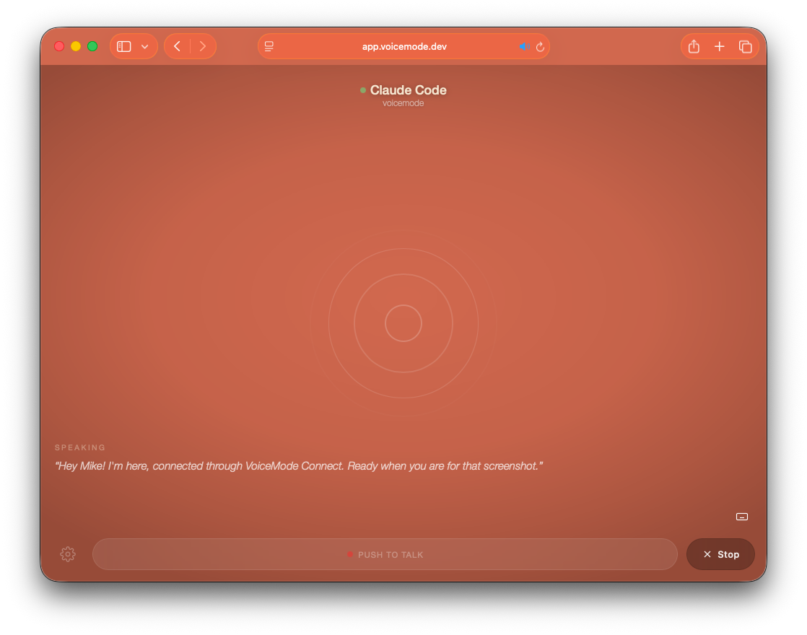

# VoiceMode Channel

A Claude Code plugin that enables inbound voice calls via [VoiceMode Connect](https://voicemode.dev).

Users speak on their phone or web app, and their messages arrive in your Claude Code session as channel events. Claude responds using the reply tool, and the response is spoken aloud on the caller's device.



```
User speaks on phone/web -> VoiceMode gateway -> Channel plugin -> Claude Code
                                                                       |
User hears TTS response  <- Channel reply tool <----------------------+
```

## Install

### Claude Code plugin

```bash
claude plugin install voicemode-channel@mbailey
```

### Standalone (any MCP host)

```bash
npx voicemode-channel
```

## Prerequisites

- Node.js 20+
- VoiceMode Connect credentials (`~/.voicemode/credentials`)
  - Run `voicemode-channel auth login` to authenticate

## Auth

Manage your VoiceMode Connect credentials:

```bash
voicemode-channel auth login    # Authenticate via browser (PKCE flow)
voicemode-channel auth logout   # Remove stored credentials
voicemode-channel auth status   # Show current auth state
```

Or via npx:

```bash
npx voicemode-channel auth login
```

## Usage

### Enable the channel

```bash
# During research preview, use the development flag
VOICEMODE_CHANNEL_ENABLED=true claude --dangerously-load-development-channels plugin:voicemode-channel@mbailey
```

### Make a call

Open **[app.voicemode.dev](https://app.voicemode.dev)** on your phone or browser. Sign in with the same account, tap the call button, and speak. Claude will respond and you'll hear TTS audio playback.

## Configuration

| Environment Variable | Default | Description |
|---------------------|---------|-------------|
| `VOICEMODE_CHANNEL_ENABLED` | `false` | **Required.** Must be `true` to enable. Server exits immediately otherwise. |
| `VOICEMODE_CHANNEL_DEBUG` | `false` | Enable debug logging |
| `VOICEMODE_CONNECT_WS_URL` | `wss://voicemode.dev/ws` | WebSocket gateway URL |
| `VOICEMODE_AGENT_NAME` | `voicemode` | Agent identity for gateway registration |
| `VOICEMODE_AGENT_DISPLAY_NAME` | `Claude Code` | Display name shown to callers |

## How it works

This plugin provides an MCP server that declares the experimental `claude/channel` capability. It:

1. Connects to the VoiceMode Connect WebSocket gateway (authenticated via Auth0)
2. Registers as a callable agent so callers can reach it
3. Receives voice transcripts and pushes them as channel notifications
4. Provides a `reply` tool for Claude to send responses back

Channel events appear in Claude's session as:
```
<channel source="voicemode-channel" caller="NAME">TRANSCRIPT</channel>
```

## Troubleshooting

**Channel not connecting**
- Ensure `VOICEMODE_CHANNEL_ENABLED=true` is set
- Check credentials exist: `voicemode-channel auth status`
- Re-authenticate: `voicemode-channel auth login`
- Enable debug logging: `VOICEMODE_CHANNEL_DEBUG=true`

**No audio on caller's device**
- Confirm you're signed into [app.voicemode.dev](https://app.voicemode.dev) with the same account
- Check that Claude is using the `reply` tool (not a plain text response)

**Plugin not found after install**
- Verify Claude Code v2.1.80+ is installed: `claude --version`
- Reinstall: `claude plugin install voicemode-channel@mbailey`

**Hook timeout on startup**
- The SessionStart hook installs npm dependencies -- this may take a moment on first run
- Subsequent starts use the cached install and are fast

## Development

```bash
# Clone and test locally
git clone https://github.com/mbailey/voicemode-channel.git
cd voicemode-channel
npm install

# Build
make build

# Test with --plugin-dir
VOICEMODE_CHANNEL_ENABLED=true claude --plugin-dir . --dangerously-load-development-channels server:voicemode-channel
```

### Testing with mcptools

[mcptools](https://github.com/f/mcptools) provides an interactive shell for testing MCP servers (`brew install mcptools`):

```bash
make shell
```

Example session:

```
mcp > tools                              # List available tools
mcp > status                             # Check connection state
mcp > reply {"text":"hello from cli"}    # Send a voice reply
mcp > profile                            # View agent profile
mcp > profile {"voice":"af_sky"}         # Update profile fields
mcp > /q                                 # Quit
```

The MCP Inspector web UI is also available:

```bash
make inspect
```

## Status

Research preview. Requires Claude Code v2.1.80+ with channel support.

## License

MIT
